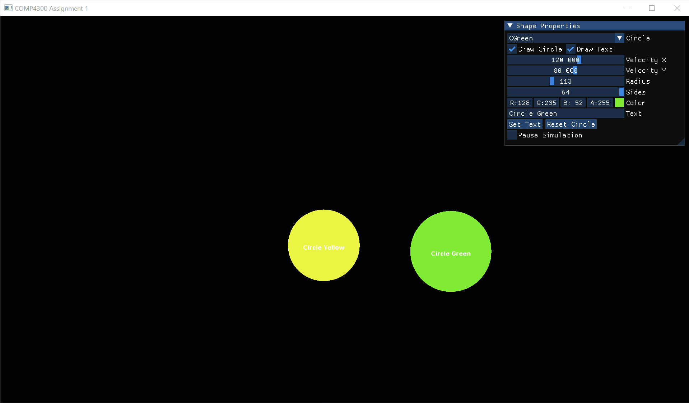

# COMP 4300 - Fall 2023 - C++ Game Programming
## Assignment 1



### Tools
- [Visual Studio 2022](https://visualstudio.microsoft.com/vs/)
- [vcpkg](https://devblogs.microsoft.com/cppblog/vcpkg-is-now-included-with-visual-studio/) (C/C++ package manager)
- [CMake](https://cmake.org/) (build tool)

### Libraries
- [SFML - 2.5.1](https://github.com/SFML/SFML) to easily interact with your computer hardware!
- [imgui-sfml](https://github.com/SFML/imgui-sfml) integration library to render imgui with sfml
- [imgui](https://github.com/ocornut/imgui) powerful user interface library to easily interact with our application
- [yaml-cpp](https://github.com/jbeder/yaml-cpp) to read/parse [config.yaml](./resources/config.yaml) (but **WHY** yaml !?, watch the following [video](https://www.youtube.com/watch?v=BEki_rsWu4E&ab_channel=KahanDataSolutions))

### Setup

1. Download [Visual Studio 2022](https://visualstudio.microsoft.com/vs/) (make sure to select the [necessary components from the installer](https://devblogs.microsoft.com/cppblog/vcpkg-is-now-included-with-visual-studio/#:~:text=You%20can%20also%20find%20it%20in%20the%20installer%20by%20searching%20for%20vcpkg%20package%20manager%20under%20the%20Individual%20components%20tab.))
2. Clone repository ```git clone https://github.com/JorgeMag96/comp4300-assignment-1.git``` and open in Visual Studio 2022
4. Install libraries in manifest mode by running ```vcpkg install```; it basically downloads the dependencies found in [vcpkg.json](./vcpkg.json) (more info can be found [here](https://learn.microsoft.com/en-us/vcpkg/users/manifests))
5. Update ```CMAKE_TOOLCHAIN_FILE``` value in [CMakePresets.json](./CMakePresets.json#L13) with output from previous command (more info can be found [here](https://cmake.org/cmake/help/latest/variable/CMAKE_TOOLCHAIN_FILE.html))

For more information on this project structure, you can reference this [blog post](https://learn.microsoft.com/en-us/vcpkg/users/buildsystems/cmake-integration)
